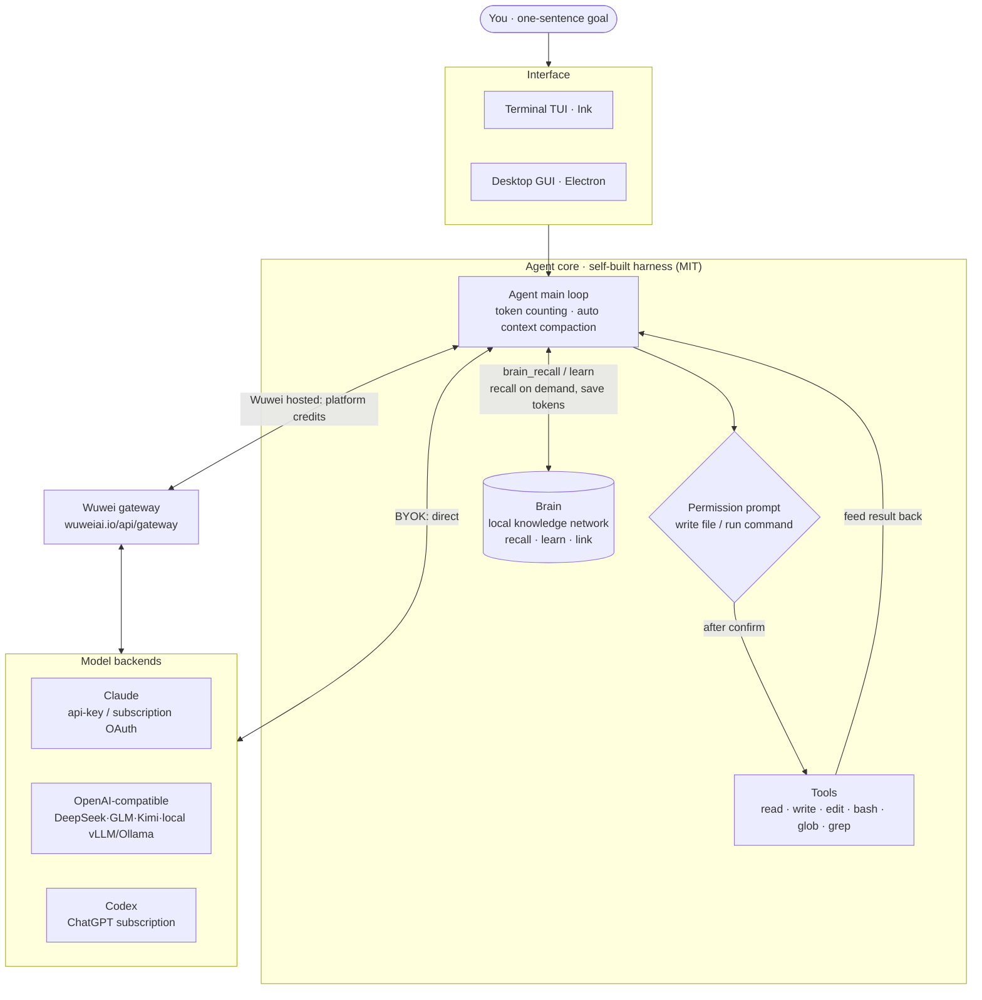

<div align="center">

# Wuwei AI

**A free, open-source, local-first AI agent client**

Tell an AI what you want in one sentence: read/write files, precise edits, run commands, search the web — every step behind a permission prompt.
Switch between Claude / OpenAI / Chinese LLMs in one click, bring your own key or use Wuwei's hosted credits.

[Website](https://wuweiai.io) · [Download](https://wuweiai.io) · [简体中文](./README.zh-CN.md)

 

<br/>

<!-- Real screen recording (English), HD GIF autoplays. Click to open the higher-quality mp4 -->
<a href="https://github.com/wuwei-io/wuwei/releases/download/demo-media/demo-en.mp4"></a>

<sub>Live demo · click to watch the HD mp4</sub>

</div>

---

## What is this

Wuwei is an **AI agent** — not autocomplete, not a chat box. At its core: a **large language model + a tool-execution loop + an interface** (terminal TUI / desktop GUI).

You state a goal and it reads files, edits code, runs commands, and searches the web to finish the task from start to end — while the harness is fully self-built, open source and auditable, with your code and data staying on your own machine.

- 🆓 **Genuinely free** — works out of the box, no subscription, no credit card
- 💻 **Local-first** — your project and code stay on your machine, never uploaded somewhere you can't see
- 🔍 **Open source (MIT)** — auditable line by line, no hidden telemetry, no region tagging
- 🔌 **Bring any model** — Claude / any OpenAI-compatible endpoint / local models (vLLM, Ollama) / Chinese LLMs, one-click switch
- 🌏 **Direct access in China** — no VPN needed for Chinese models
- 🛡️ **Permission prompts** — confirm before writing files or running commands (`y` / `N` / `a` = always allow this tool)
- 🧠 **Brain (local knowledge network)** — a local concept knowledge network that captures project / deployment / gotcha knowledge; recall subgraphs on demand via `brain_recall`, saving tokens instead of re-reading whole docs every time

## Brain · local knowledge network

A **concept knowledge network** that runs locally: it **structurally captures** project background, git paths, test / production environments, deploy-script locations, gotchas and more, then recalls them on demand — instead of stuffing the whole doc into context every time.

- `brain_recall` — recall the relevant concept subgraph per task (+ hits from your doc library, returning only summary + path)
- `brain_learn` / `brain_link` — remember high-value knowledge and wire up relations; same-name overwrite corrects stale info
- `brain_read_doc` — read the full text by path when you need it, no full scan required

> Note: Brain is a **Wuwei hosted / member** capability. You can toggle it and view / override its prompt in the "Knowledge Network" settings. When off, the `brain_*` tools and their instructions are disabled together.

## Architecture

Interface (TUI / GUI) → self-built agent main loop → tool execution (with permission prompts) ↔ model backend.
Models connect two ways: **bring-your-own-key direct** or the **Wuwei hosted gateway**.



## Two ways to use it

1. **Bring your own key (BYOK)** — fill in your own API key or local endpoint; fully free, data never goes through a third party.
2. **Wuwei hosted** — use platform credits with zero config; even works free without login (see the [website](https://wuweiai.io)).

## Quick start

### Desktop (recommended)

Download the installer for your OS (Windows / macOS / Linux) at [wuweiai.io](https://wuweiai.io) and you're ready to go.

### CLI / run from source

```bash
git clone https://github.com/wuwei-io/wuwei.git
cd wuwei
npm install

# Option 1: Claude API
export ANTHROPIC_API_KEY=sk-ant-...
export WUWEI_MODEL=claude-sonnet-5        # optional
npm run dev

# Option 2: local / OpenAI-compatible endpoint (vLLM / Ollama, etc.)
export WUWEI_BASE_URL=http://localhost:8000/v1
export WUWEI_MODEL=qwen3-coder
npm run dev
```

After it starts, just type your request. Common commands: `/reset` clears the conversation · `/exit` quits. File-write / command-run operations ask for confirmation.

### Desktop dev / packaging

```bash
npm run desktop:dev          # dev
npm run desktop:build        # build
npm run pack:wuwei           # Windows installer
npm run desktop:pack         # macOS installer
```

## Supported model backends

`anthropic` (API key) · `anthropic` + OAuth (Claude subscription / Claude Code) · `openai`-compatible (DeepSeek / Zhipu GLM / Kimi / MiniMax / Doubao / Qwen / Hunyuan / Grok / local vLLM·Ollama) · `codex` (ChatGPT subscription). Credentials are saved in separate slots per platform; switch provider / model from the bottom bar in one click.

## Project structure

```
src/                CLI (terminal TUI)
  index.tsx           entry: builds the Agent and renders the Ink UI
  config.ts           picks the model backend from env vars
  agent/
    loop.ts           agent main loop + token counting + auto context compaction
    provider.ts       multi-backend: anthropic / openai-compatible / codex
    prompt.ts         system prompt
  tools/index.ts      tools: read / write / edit / bash / glob / grep
  ui/                 Ink TUI components
desktop/            desktop (Electron)
  main/               main process: provider presets, account credits, key vault
  renderer/           renderer: multi-session, streaming, Markdown, images
```

## Saving tokens

Long tasks won't break: when the context exceeds `WUWEI_COMPACT_THRESHOLD` (default 80% of the window) old history is auto-compacted into a summary; `WUWEI_KEEP_RECENT` (default 6) keeps the most recent turns.

## Contributing

Issues and PRs welcome. Run `npm run typecheck` before submitting to make sure types pass.

## Links

- 🌐 **Website & download**: [wuweiai.io](https://wuweiai.io)
- 🐦 **X / Twitter**: [@usewuwei](https://x.com/usewuwei)

Looking for a free, local, open-source alternative to a specific tool? See how Wuwei compares:

- [vs Cursor](https://wuweiai.io/vs/cursor-alternative)
- [vs GitHub Copilot](https://wuweiai.io/vs/github-copilot-alternative)
- [vs Claude Code](https://wuweiai.io/vs/claude-code-free-alternative)
- [vs Windsurf](https://wuweiai.io/vs/windsurf-alternative)
- [vs Cline](https://wuweiai.io/vs/cline-alternative)
- [vs Aider](https://wuweiai.io/vs/aider-alternative)
- [All comparisons →](https://wuweiai.io/vs)

## License

[MIT](./LICENSE) © 2026 Wuwei (无为)
